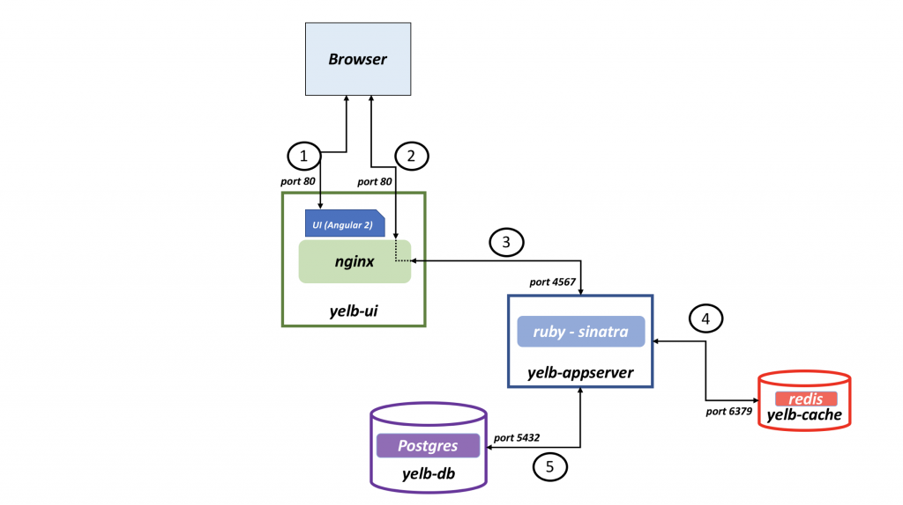
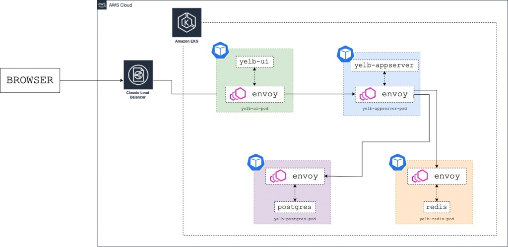

# Demo 


## Pre-requisite steps
---

## Install needed tools

- Install latest [aws-cli](https://docs.aws.amazon.com/cli/latest/userguide/installing.html).
- Install latest [eksctl](https://docs.aws.amazon.com/eks/latest/userguide/eksctl.html)
- Install kubectl

```
curl -LO https://storage.googleapis.com/kubernetes-release/release/`curl -s https://storage.googleapis.com/kubernetes-release/release/stable.txt`/bin/linux/amd64/kubectl
chmod +x ./kubectl
sudo mv ./kubectl /usr/local/bin/kubectl
```

- Install Helm

```
curl -fsSL -o get_helm.sh https://raw.githubusercontent.com/helm/helm/master/scripts/get-helm-3
chmod 700 get_helm.sh
./get_helm.sh
```


## Create Amazon EKS Cluster


Create file cluster.yml with the content below:

```
# A simple example of ClusterConfig object:
apiVersion: eksctl.io/v1alpha5
kind: ClusterConfig

metadata:
  name: "l3series"
  region: eu-west-1
  version: "1.26"

iam:
  withOIDC: true  


managedNodeGroups:
  - name: mn
    labels: { role: workers }
    instanceType: t3.medium
    desiredCapacity: 1
    minSize: 1
    maxSize: 3      
    privateNetworking: true
    ssh:
        enableSsm: true    

cloudWatch:
 clusterLogging:
   enableTypes: ["audit", "authenticator", "controllerManager"]    

```

```
eksctl create cluster -f cluster.yml
```


## Deploy App Mesh controller

[App Mesh controller for Kubernetes](https://docs.aws.amazon.com/app-mesh/latest/userguide/getting-started-kubernetes.html)


**Add the eks-charts repository to Helm**
```
helm repo add eks https://aws.github.io/eks-charts
```

**Install the App Mesh Kubernetes custom resource definitions (CRD)**

```
kubectl apply -k "https://github.com/aws/eks-charts/stable/appmesh-controller/crds?ref=master"

customresourcedefinition.apiextensions.k8s.io/backendgroups.appmesh.k8s.aws created
customresourcedefinition.apiextensions.k8s.io/gatewayroutes.appmesh.k8s.aws created
customresourcedefinition.apiextensions.k8s.io/meshes.appmesh.k8s.aws created
customresourcedefinition.apiextensions.k8s.io/virtualgateways.appmesh.k8s.aws created
customresourcedefinition.apiextensions.k8s.io/virtualnodes.appmesh.k8s.aws created
customresourcedefinition.apiextensions.k8s.io/virtualrouters.appmesh.k8s.aws created
customresourcedefinition.apiextensions.k8s.io/virtualservices.appmesh.k8s.aws created
```

## Create a Kubernetes namespace for the controller.

```
kubectl create ns appmesh-system

namespace/appmesh-system created
```

**Set the following variables for use in later steps. Replace cluster-name and Region-code with the values for your existing cluster.**

```
export CLUSTER_NAME=l3series
export AWS_REGION=eu-west-1
```

## Create an IAM role, attach the AWSAppMeshFullAccess and AWSCloudMapFullAccess AWS managed policies to it, and bind it to the appmesh-controller Kubernetes service account

```
eksctl create iamserviceaccount \
    --cluster $CLUSTER_NAME \
    --namespace appmesh-system \
    --name appmesh-controller \
    --attach-policy-arn  arn:aws:iam::aws:policy/AWSCloudMapFullAccess,arn:aws:iam::aws:policy/AWSAppMeshFullAccess \
    --override-existing-serviceaccounts \
    --approve \
    --profile staging
```

## Deploy the App Mesh controller. For a list of all configuration options, see Configuration on GitHub.

```
helm upgrade -i appmesh-controller eks/appmesh-controller \
    --namespace appmesh-system \
    --set region=$AWS_REGION \
    --set serviceAccount.create=false \
    --set serviceAccount.name=appmesh-controller    

output:
AWS App Mesh controller installed!
```

## Confirm that the controller version is v1.4.0 or later. You can review the change log on GitHub.

```
kubectl get deployment appmesh-controller \
    -n appmesh-system \
    -o json  | jq -r ".spec.template.spec.containers[].image" | cut -f2 -d ':'

v1.11.0    
```

## Confirm Controller Pods are running

```
% kubectl get pods -n appmesh-system
NAME                                  READY   STATUS    RESTARTS   AGE
appmesh-controller-7bc98bb568-6kbfv   1/1     Running   0          60s


kubectl logs -f -l app.kubernetes.io/name=appmesh-controller -n appmesh-system

kubectl get crds | grep appmesh

kubectl get ValidatingWebhookConfiguration 

kubectl get MutatingWebhookConfiguration
```

## (Optional) - Deploy Container Insight 

**You can skip this step**
[Container Insights on Amazon EKS or Kubernetes](https://docs.aws.amazon.com/AmazonCloudWatch/latest/monitoring/deploy-container-insights-EKS.html)

```
# Set environment variables
CLUSTER_NAME="l3series"
AWS_REGION=eu-west-1

# Deploy Container Insights
curl https://raw.githubusercontent.com/aws-samples/amazon-cloudwatch-container-insights/master/k8s-yaml-templates/quickstart/cwagent-fluentd-quickstart.yaml | \
sed "s/{{cluster_name}}/$CLUSTER_NAME/;s/{{region_name}}/$AWS_REGION/" | kubectl apply -f -
```

# Deploy App Mesh resources - Example

1. Create an App Mesh service mesh 

```
kubectl apply -f mesh.yaml
```

2. Create an App Mesh virtual node. A virtual node acts as a logical pointer to a Kubernetes deployment.

```
kubectl apply -f virtual-node.yaml
```

- The virtual node represents a Kubernetes service that is created in a later step. 
- The value for hostname is the fully qualified DNS hostname of the actual service that this virtual node represents.

3. Create an App Mesh virtual router. Virtual routers handle traffic for one or more virtual services within your mesh.

```
kubectl apply -f virtual-router.yaml
```

4. Create an App Mesh virtual service. A virtual service is an abstraction of a real service that is provided by a virtual node directly or indirectly by means of a virtual router. Dependent services call your virtual service by its name

```
kubectl apply -f virtual-service.yaml
```

5. Create a Kubernetes service and deployment

```
kubectl apply -f my-service-a.yaml
```

**The value for the app matchLabels selector in the spec must match the value that you specified when you created the virtual node or the sidecar containers won't be injected into the pod**


## Reviewing the App Mesh Resources

```
kubectl describe mesh my-mesh

aws appmesh describe-mesh --mesh-name my-mesh

kubectl describe virtualnode my-service-a -n my-apps

aws appmesh describe-virtual-node --mesh-name my-mesh --virtual-node-name my-service-a_my-apps

kubectl describe virtualrouter my-service-a-virtual-router -n my-apps

aws appmesh describe-virtual-router --virtual-router-name my-service-a-virtual-router_my-apps --mesh-name my-mesh

kubectl describe virtualservice my-service-a -n my-apps

aws appmesh describe-virtual-service --virtual-service-name my-service-a.my-apps.svc.cluster.local --mesh-name my-mesh

kubectl -n my-apps describe pod my-service-a-XXXXXX
```
---

# Demo

## Architecture



## Deploy A Demo App

```
kubectl apply -f infrastructure/yelb_initial_deployment.yaml

namespace/yelb created
service/redis-server created
service/yelb-db created
service/yelb-appserver created
service/yelb-ui created
deployment.apps/yelb-ui created
deployment.apps/redis-server created
deployment.apps/yelb-db created
deployment.apps/yelb-appserver created

```

**Let's see all we've deployed**

```
l3-appmesh-eks % kg all -n yelb
NAME                                  READY   STATUS    RESTARTS   AGE
pod/redis-server-76d7b647dd-hrfmf     1/1     Running   0          3m25s
pod/yelb-appserver-56d6d6685b-xpc56   1/1     Running   0          3m24s
pod/yelb-db-5dfdd5d44f-phm2q          1/1     Running   0          3m25s
pod/yelb-ui-56545895f-dcrlt           1/1     Running   0          3m25s

NAME                     TYPE           CLUSTER-IP       EXTERNAL-IP                                                             PORT(S)        AGE
service/redis-server     ClusterIP      10.100.192.153   <none>                                                                  6379/TCP       3m25s
service/yelb-appserver   ClusterIP      10.100.96.155    <none>                                                                  4567/TCP       3m25s
service/yelb-db          ClusterIP      10.100.78.233    <none>                                                                  5432/TCP       3m25s
service/yelb-ui          LoadBalancer   10.100.132.249   ae0ccb08a91b84e87806bac79dc0d359-39741638.eu-west-1.elb.amazonaws.com   80:32178/TCP   3m25s

NAME                             READY   UP-TO-DATE   AVAILABLE   AGE
deployment.apps/redis-server     1/1     1            1           3m25s
deployment.apps/yelb-appserver   1/1     1            1           3m25s
deployment.apps/yelb-db          1/1     1            1           3m25s
deployment.apps/yelb-ui          1/1     1            1           3m25s

NAME                                        DESIRED   CURRENT   READY   AGE
replicaset.apps/redis-server-76d7b647dd     1         1         1       3m25s
replicaset.apps/yelb-appserver-56d6d6685b   1         1         1       3m25s
replicaset.apps/yelb-db-5dfdd5d44f          1         1         1       3m25s
replicaset.apps/yelb-ui-56545895f           1         1         1       3m25s
```

## Deploy a testing pod - for troubleshooting (optional) 
**You can skip this step**

```
kubectl run curler --image=nginx
kubectl exec -it curler -- sh
apt-get update -y
apt-get install -y iputils-ping
apt-get install telnet -y
apt-get install dnsutils -y

# Test connectivity to the service
nslookup yelb-ui.yelb.svc.cluster.local
dig +short yelb-ui.yelb.svc.cluster.local
curl http://yelb-ui.yelb.svc.cluster.local
curl http://yelb-ui.yelb.svc.cluster.local

```

**To get the Pod IPs**

```
% kubectl get po -n yelb -o wide
NAME                              READY   STATUS    RESTARTS   AGE   IP                NODE                                           NOMINATED NODE   READINESS GATES
redis-server-76d7b647dd-hrfmf     1/1     Running   0          17m   192.168.142.58    ip-192-168-149-34.eu-west-1.compute.internal   <none>           <none>
yelb-appserver-56d6d6685b-xpc56   1/1     Running   0          17m   192.168.146.49    ip-192-168-149-34.eu-west-1.compute.internal   <none>           <none>
yelb-db-5dfdd5d44f-phm2q          1/1     Running   0          17m   192.168.154.185   ip-192-168-149-34.eu-west-1.compute.internal   <none>           <none>
yelb-ui-56545895f-dcrlt           1/1     Running   0          17m   192.168.129.216   ip-192-168-149-34.eu-west-1.compute.internal   <none>           <none>
```

**(Optional)In general a Pod has the following DNS resolution:**
```
pod-ip-address.my-namespace.pod.cluster-domain.example.
i.e
192-168-129-216.yelb.pod.cluster.local
```

So we can test connectivity directly to the pod via its IP or DNS

```
kubectl exec -it curler -- sh
# ping 192.168.129.216
PING 192.168.129.216 (192.168.129.216) 56(84) bytes of data.
64 bytes from 192.168.129.216: icmp_seq=1 ttl=63 time=1.02 ms
^C
--- 192.168.129.216 ping statistics ---
3 packets transmitted, 3 received, 0% packet loss, time 2030ms
rtt min/avg/max/mdev = 0.048/0.378/1.019/0.453 ms
# curl 192.168.129.216
<!doctype html>
<html>
<head>
    <script src="env.js"></script>
    <meta charset="utf-8">
    <title>Yelb</title>
    <base href="/">
...

# ping 192-168-129-216.yelb.pod.cluster.local
PING 192-168-129-216.yelb.pod.cluster.local (192.168.129.216) 56(84) bytes of data.
64 bytes from 192-168-129-216.yelb-ui.yelb.svc.cluster.local (192.168.129.216): icmp_seq=1 ttl=63 time=0.029 ms
```

**To get the URL of the load balancer for carrying out testing in your browser, use the following command:**

```
$ kubectl get service yelb-ui -n yelb
NAME      TYPE           CLUSTER-IP      EXTERNAL-IP                                                               PORT(S)        AGE
yelb-ui   LoadBalancer   172.20.19.116   a96f5309de3csdc19847045bfbd34bd4-XXXXXXXXXX.us-west-2.elb.amazonaws.com   80:30467/TCP   26s
```

## Meshify The Demo App



1. Label the namespace
   **We deploy the Yelb application in the yelb namespace and use the same name for the mesh. You need to add two labels to the yelb namespace: `mesh` and `appmesh.k8s.aws/sidecarInjectorWebhook`. These labels instruct the controller to inject and configure the Envoy proxies in the pods:**  

```
kubectl label namespace yelb mesh=yelb 
kubectl label namespace yelb appmesh.k8s.aws/sidecarInjectorWebhook=enabled
```

2. Create the mesh

```
# Create the manifest with the mesh config:
$ cat <<"EOF" > /tmp/yelb-mesh.yml
apiVersion: appmesh.k8s.aws/v1beta2
kind: Mesh
metadata:
  name: yelb
spec:
  namespaceSelector:
    matchLabels:
      mesh: yelb
EOF

# Create mesh with above configuration:
$ kubectl apply -f /tmp/yelb-mesh.yml
mesh.appmesh.k8s.aws/yelb created
```

- Verify the outcome from App Mesh console

**NOTE: The `namespaceSelector` parameter matches Kubernetes namespaces with the label `mesh` and the value `yelb`.**

3. Create all the App Mesh components for every Yelb component

```
kubectl apply -f infrastructure/appmesh_templates/appmesh-yelb-redis.yaml
kubectl apply -f infrastructure/appmesh_templates/appmesh-yelb-db.yaml
kubectl apply -f infrastructure/appmesh_templates/appmesh-yelb-appserver.yaml
kubectl apply -f infrastructure/appmesh_templates/appmesh-yelb-ui.yaml

virtualnode.appmesh.k8s.aws/redis-server created
virtualservice.appmesh.k8s.aws/redis-server created
virtualnode.appmesh.k8s.aws/yelb-db created
virtualservice.appmesh.k8s.aws/yelb-db created
virtualnode.appmesh.k8s.aws/yelb-appserver created
virtualrouter.appmesh.k8s.aws/yelb-appserver created
virtualservice.appmesh.k8s.aws/yelb-appserver created
virtualnode.appmesh.k8s.aws/yelb-ui created
virtualservice.appmesh.k8s.aws/yelb-ui created
```

- Verify the outcome from App Mesh console

4. Delete the existing pods to trigger the creation of new pods with the Envoy sidecars

```
kubectl -n yelb delete pods --all
pod "redis-server-76d7b647dd-hrfmf" deleted
pod "yelb-appserver-56d6d6685b-xpc56" deleted
pod "yelb-db-5dfdd5d44f-phm2q" deleted
pod "yelb-ui-56545895f-dcrlt" deleted   
```  


## Clean Up

./infrastructure/cleanup.sh